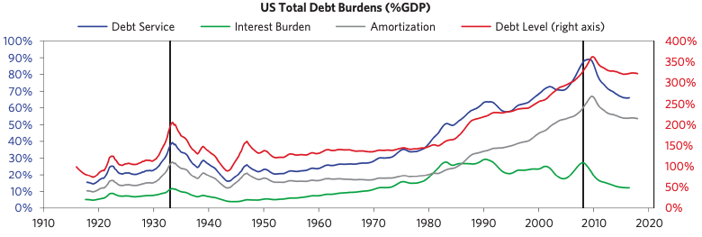

# Part I : 전형적인 부채 사이클

Ch1. 대형 금융 위기를 이해하는 기본 템플릿

- 신용과 부채란 무엇인가?
- 전형적인 장기/대형 부채 사이클 템플릿
- 사이클 분석

## 1\. 신용과 부채란 무엇인가?

신용: 구매력 얻는 것
부채: 구매력을 제공받는 대신 그 대가로 나중에 상환하겠다는 약속

### **[신용과 부채의 성장이 부정적인가?]**

신용 측면에서 바라보면
=\> 지나치게 더디면 지나치게 클 때와 마찬가지로 부정적인 현상이다.
=\> 기회비용의 형태로 비용을 발생시키기 때문
부채의 측면에서 바라보면
=\> 부채가 생산적인 일에 사용 되었는가?
=\> 즉, 부채를 상환하기에 충분한 수익이 창출되었느냐? 에 달렸음

부채의 성장이 개인에게는 부정적인 측면이 강조 되지만, 시장 경제에는 다름
정책 입안자는 개인이 없는 특권이 있다.

**손실 분산이 가능하게 하는 두 가지 요건**
1) 부채 표시 화페가 정책 입안자가 통제 가능한 화폐
2) 채권자와 채무자의 상호 행태에 정책 입안자가 영향력 행사가 가능할 것

### **\[부채 위기는 왜 주기적으로 발생할까?\]**

부채 사이클은 직관이나 감, 또는 점쟁이 같이 입증이 안되는 요소가 아님.
정형화된 패턴으로써 논리적인 원인으로 촉발이 된다.

**\[모노폴리의 예\] : 기본적인 이해를 돕는 예시**

- 초반: 현금이 많고 부동산이 적음 -\> 부동산이 이득
- 후반: 부동산이 많고 현금이 적음 -\> 현금이 이득
- 자산을 부동산과 현금으로 적절히 배분하는 방법을 잘 이해하는 사람 = 승자
- 여기에 대출과 예금 기능 있는 은행 추가하면?
- 그리고 참가자끼리 신용으로 부동산 매매가 가능하다면?
- 시장에 존재하는 현금보다 호텔 매입에 사용된 대출금액이 몇배가 됨
- 1.  호텔 소유 채무자들: 임대료 & 부채로 현금 부족
- 2.  예금자들 인출 & 채무자 연채 -\> 은행 파산
- 3.  경기 침체

**대출은 자기 강화적이다: 스스로 대출을 일으킨다**

- 상승 곡선을 그리다가 결국 스스로 대출을 줄인다 -\> 반복
- 대출이 오르면: 소비 투자 오름 -\> 소득 자산가격 오름
- 소득 자산가격 오름 -\> 대출이 올라감
- 경제의 일정한 생산성 성장을 넘어서는 수준 (무한정 계속된다는 기대)

대형 사이클에 취약한 경기 타입
1\) 건설사업 경기 부양 국가들
2\) 임금 경쟁력 신흥국

레버리지란? : 부채 비율이 높을수록 자기자본 이익률이 상승하는 현상.
즉 타인자본을 빌려 이를 지렛대(leverage)삼아 적은 자기자본으로 큰 수익을 올리는 형태.

부채 사이클로 야기되는 두 가지 장기적인 문제
1) 부채 원리금 상환이 이루어지지 않아 발생하는 손실
2) 대출과 소비가 계속 감소하는 문제

\[부채 위기 관리가 가능 한가\]
자국 통화로 표시된 부채로 촉발된 위기 대부분은 적절하게 관리 가능
부채 그 자체는 큰 위험이 아님 -\> 실제 위기는 2가지
1) 올바르지 못한 정책 입안자 정책 (지식/권한 부족)
2) 도와 주는 과정에서 일부 사람들에게 피해 주는 정치적 결과

부채 비중과 상환 금액을 낮추는 데 활용할 수 있는 4가지 정책
1) 긴축 (지출 축소)
2) 채무 불이행과 채무 재조정
3) 중앙은행 화폐 찍어내기 & 부채 인수(or 보증)
4) 부의 재분배 (부자한테 뺏어서 빈곤에 뿌리기)

어려운 이유: 대상을 선정(누군가는 이득 누군가는 손해) 그리고 실행 시기를 잘 봐야함 -\> 잘해도 욕먹는 이유

## 2\. 전형적인 장기/대형 부채 사이클 템플릿

연구에 대한 기본 basis
1) 불황 : 실질 GDP가 3% 이상 하락한 상황 (실질 GDP?)
2) 국가를 두 가지로 분류

- 외화부채가 많지 않고 인플레이션형 불황을 겪지 않은 국가
- 외화부채가 상당하고 인플레이션형 불황을 겪는 국가

전형적인 장기 부채 사이클

- 부채 위기: 부채와 부채 상환 비용이 빚을 갚는데 필요한 소득보다 빠르게 증가하고 디레버리징 일어날 때 생김
- 실질/명목 금리를 인하하는 것이 더이상 불가할 때 대형 부채 위기가 발생

디레버리징: 부채나 차입을 줄이는 행위 (즉 시장입장에서 유동성 회수)

명목 금리: 화폐 1단위를 일정 기간 동안 빌리는 대가로 지불한 화폐액으로서 이자를 원금으로 나눈 값으로 계산함

실질 금리: 명목 금리 \- 인플레이션율 (이자의 실질 구매력)

\[그래프 분석\]

- 부채가 증가해도 이자 비용은 그대로 유지되거나 감소함
- 결국 부채 상환 부담은 부채만큼 빠르게 증가하지 않음 (금리 인하)
- 한계1: 각 경기 주체들이 저마다 얼마나 많은 부채를 부담하는지 구분 X
- 한계2: 부체의 종류 구분이 되어 있지 않음

## 3\. 사이클 분석

앞으로 사이클을 분석하면 짚을 포인트

1\) 불황에 이르는 기간
2\) 불황의 바닥을 찍은 뒤 이어지는 디레버리징 기간

자료에 대한 기본 basis
1\) 단계별 도표에 반영된 통계는 디플레이션형 부채 사이클 21개 인플레이션형 부채 사이클  27개 사례 평균치
2\) 기점: 기간은 불황의 정점 5년
     종점:  정점 지난 후 7년
	 
시장 참여자
1\) 프롤레타리아(노동자) - 자신의 시간을 팔아 돈을 번다
2\) 자본가(투자자) - 남에게 돈을 빌려줘서 돈을 번다

이 측면에서 보면 화폐의 두가지 기능이 보임
1\) 교환의 매개
2\) 부의 저장 수단

일반적으로는 두 집단 모두 대출을 통해 이득을 얻지만 때로는 거래 한 후 손해를 한쪽이 얻게 될 때가 존재
-> 이것을 화폐에 대한 통제권이 있는 주체가 하게 됨 (앞서 말한 4가지 정책으로)

앞으로 불황을 두 가지로 분류해서 다루게 될 것

1\) 디플레이션 불황
- 경기 침체 초기에 금리를 인하함
- 0%대 진입하면 더 이상 금리 인하가 불가능
- 채무 재조정과 긴축 재정 정책을 함
- 부채 상환이 일어나면서 부채 총량은 조금 줄어듦
- 소득이 채무재조정보다 빠르게 감소
- 채무자들의 부채 부담이 늘어남 (소득 대비 부채 원리금 상환 비율)
- 높은 이자 비용을 감당하기 위해 더 빚을 지게 됨
- 자산 강매나 채무 불이행이 생기지만 통화나 국제수지와 관련된 문제는 발생하지 않음

2\) 인플레이션 불황
- 외국 자본에 의존한 부채
- 화폐화할 수 없는 상당량의 와화 부채
- 외국 자본 유입이 감소
- 신용경색으로 전환
- 외국 투자자 투자금 회수
- 통화 가치 하락 -> 인플레이션 유발
- 관리 안됨

