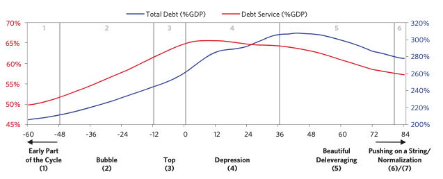
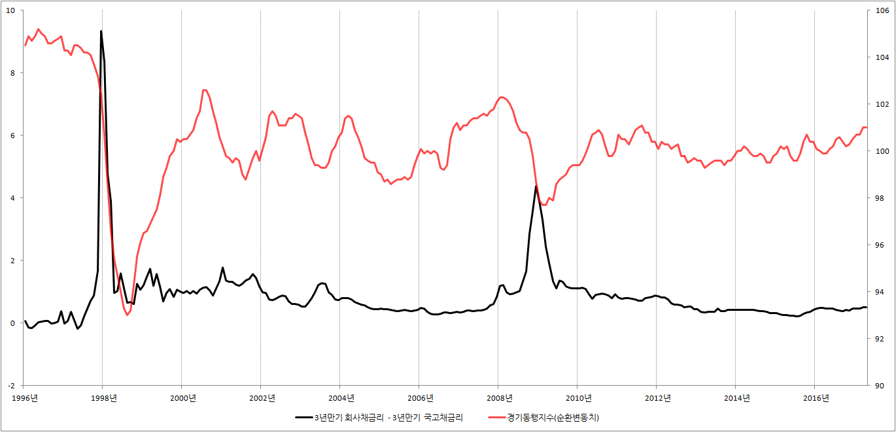
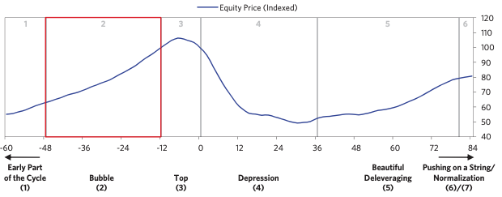
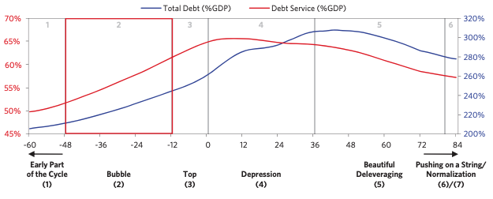
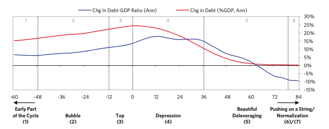
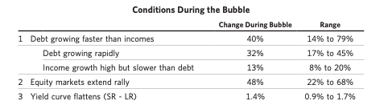
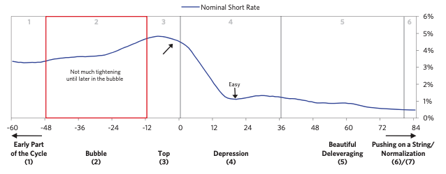
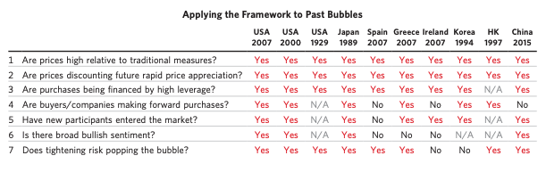

# 2\. 전형적인 디플레이션형 부채 사이클 국면

- 디플레션형 부채 사이클은 기축통화국에 해당되는 사이클이다. (미국 생각하면 될듯)

이 사이클은 장기적인 사이클을 나타내는 그래프

- 즉, 이 사이클 진행 중 여러 작은 사이클이 있음
- 평균치를 넘어서는 값들은 제외함
- 7단계로 나누고 12년에 걸쳐 나타냄
- 경제의 GDP 대비 총 부채 비율 & 총부채 원리금 상환 비율의 추세
    

## 1\. 부채 사이클 초기

- 부채 증가세가 꾸준히 상승함
- 소득 증가세가 더 빠름
- 전반적으로 모두 건전한 상태
- 골디럭스라고도 함 (goldilocks)

## 2\. 버블

### 대략적인 그림

- 부채증가세 \> 소득증가세
- 자산 수익률, 자산 가격 모두 급격하게 상승
- 버블이 형성되는 과정은 자기 강화적 :
    소득/순자산/자산가치 상승 -\> 경제 주체는 더 많은 부채를 얻을 수 있게 됨
- 대출기관의 3가지 변수를 고려하여 대출 금액 결정
    1) 채무자 부채상환 능력(예상소득,현금흐름) 2) 자산가격과 함께오르는 순자산/담보가치 3) 기관의 대출여력
    버블 때는 이 세가지가 모두 다 오름
- 부채의 성장을 감당하려면 성장이 뒷바침 돼야함

### 버블시작: 강세장

- 지나치게 낙관적인 기대
- 저금리 -\> 주식/부동산/투자자산 매력적으로 만듦
- 투자자산 상승 -> 기업 이윤 증가 -> 기업 재무상태 개선 -\> 대출 강화
- 신용스프레드가 줄어듦

### \[sub: 신용스프레드?\]

신용 스프레드 : 회사채금리 \- 국고채금리

- 의미는 상식적으로 생각하면 됨
- 회사채의 금리가 오른다는 건 채무 불이행 위험이 커짐
- 회사의 전망이 좋지 않음 -\> 확대되면 경제 여건 전체가 안좋다는 뜻
    

**버블이라는 여러가지 정황들과 지표들**

- 모두가 롱 포지션 취함
- 차익을 얻기 위해 단기로 자금을 빌려 장기로 또 빌려줌
- 유동부채를 얻어 비유동자산에 투자함
- [한 국가의 통화로 자금을 빌려 다른 국가에 빌려줌](https://news.einfomax.co.kr/news/articleView.html?idxno=53586)
- 기존에 없던 새로운 유입자들이 들어옴
- 대출기관들의 심사 기준이 내려감
- 새로운 대출기관들 등장 (정부의 규제를 받지 않는 신종 대출기관 등장 일명 shadow banking)

주식가격(물가연동)의 흐름

총부채 / 부채상환

GDP대비 부채비율 변동(연단위) / 부채 변동(%GDP, 연단위)

- 디플레이션 유발형 디레버리징을 평균 냄
- GDP 대비 부채 비율의 전형적인 진행 경로
- 초기 3년간 부채규모가 GDP 대비 평균 20~25%씩 계속 증가

### 그럼 통화정책은 버블간 뭘하는데?

- 억제하기 매우 어려움 (오히려 더 키운다)
- 왜1: 버블에는 위기라는 컨센서스가 없기 때문에 정책이 시장심리에 끼치는 영향이 효과가 없음
- 왜2: 대부분 중앙은행은 성장을 중시하지 버블 관리 안함
- 미국 중앙은행은 테일러 준칙엔 부채에 대한 고려 안함ㅋㅋ
    

### 버블 포착하기

- 먼저 세계 대형 시장 중 어느 시장에 버블이 끼어있는가
- 어떤 연결 요소들이 영향을 받는가
- 경제 주체별 부채 상환 능력은 어떻게 되는가 (위 지표들의 한계점)
    