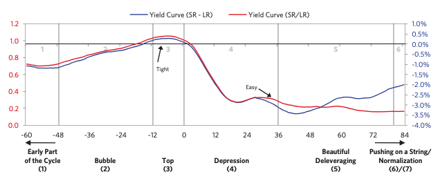
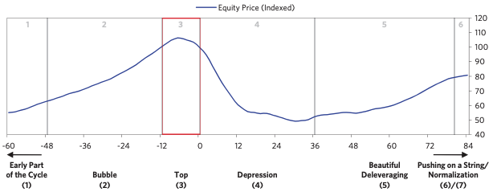
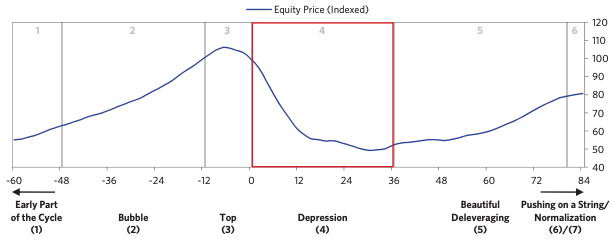
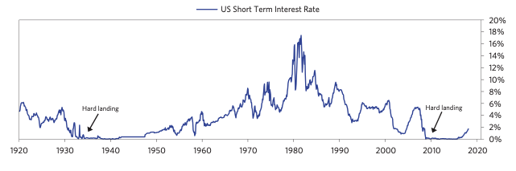
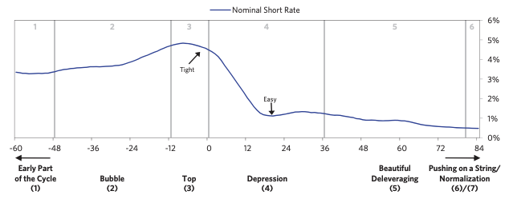
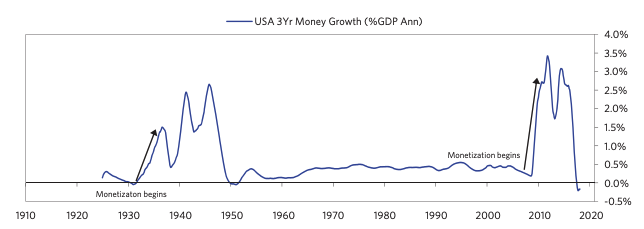

# 3. 정점

시장이 정점을 찍게 되는 계기는 다양함. but 가장 흔한 케이스는 **중앙은행이 금리 인상**할 때.
-> 우리나라 같은 국가 경우 (외부 자본 의존도가 존재/큼) : 외부적인 대출금 상환 요청 (어떤 경우일까?)

신용과 부채의 문제는 정점 찍기 약 6개월 전 부터 조짐이 드러나기 시작한다.
- 신용 스프레드 심화, 위험대출 축소
- 위험 자산 -> 안전자산으로 자금 옮겨감
- 장단기 금리 차 축소
=> 한마디로 정리하면 : 현금 보유 확대

하지만 이런 요소들이 뚜렷하게 보이지 않음. 사이클 정점 초기에는 신용체계의 약간의 문제만 생기고 다른 부분은 여전히 탄탄해서. (자산 가격 상승)

경기 침체의 강도를 가늠하려면 긴축 정책의 강도보다 경제 각 부문의 긴축 민감도/손실의 크기 파악해야됨
경제 전체 평균으로 판단하면 부정확함

정점 때 개인 투자자로서 주의해야할 일들

- 자산효과를 무시함. 버블 붕괴 시점에선 경제 성장률에 미치는 영향은 자산효과 > 통화 정책
([자산 효과](https://fnwiki.org/wealth-effect/)란? 자산가치와 소비가 따라가는 현상)
- 정점 직후 버블 붕괴 시점에 주가가 하락해도 실적이 그 전과 비교했을 때 여전히 양호핟다 판단 -> 주가 하락 시점을 매수할 적기로 생각함
- 즉 과거실적과 예상 실적 고려해서 현재 저평가라 판단
- 하지만 자산시장의 하락으로 인해 다가올 경기 침체와 실적 감소 가능성을 고려 하지 못함.
- 역 자산효과도 자기강화적 : 자산가격 하락 -> 소득 감소 -> 신용도 하락 -> 대출 제한 -> 소비 감소 -> 투자 감소 -> 금융 자산 감소 -> 기업 경제 활동 저하

# 불황

통화 정책이 효과적으로 작동하는 소규모 불황에서는 금리 인하 -> 통화량 부채 상환 불균형 해소 가능
but 장기사이클 불황기에는 버블이 터진 시점에 이미 금리가 0%에 가까워서 금리 인하 효과 없음
-> 우리나라 경우 외화유출/통화 약세가 심할 때 -> 금리 인하 안됨 (신용 리스크/통화 리스크 존재하기 때문에)

- 디플레이션형 부채위기 21개 평균값
- 0%대로 급락한 금리 흐름

가장 먼저 타격 입는 참여자 : 레버리지 비율 높은 대출기관/예금주
- 여러 대응 방식을 채용함 : 1) 은행 예금 보험 2) 최종 대부자로 금융 지원 제공/지급 보증 3) 시스템적으로 중요한 금융기관 공적 자금 투입 4) 기관 국유화
- 하지만 근본적으로 위기 해결 안됨 -> 부채 위기의 원인은 규제에서 벗어난 그림자 금융 / 위험 예측 불가, 규제에서 벗어난 신금융상품
- 불황을 심리적인 문제로 오해하는 경우가 많음
- 시장의 불안으로 투자자들이 위험자산 -> 안전자산으로 이전한다고 생각 (즉, 투자 심리 개선되면 다시 반대로 가서 경제 회복 가능하다고 판단)
- 하지만 디레버리징은 두 가지 원리로 진행됨
- 1) 심리가 아니라 주로 신용/돈/재화 <-> 서비스 관계
- 2) 수요/공급으로 진행됨.

만약 당장 어떤 부양책이 이뤄지지 않았을 때 : 통화량이 그대로니까 유동성이 그냥 다른 자산군으로 흐르는거 아니냐?
-> 돈은 신용이다. 신용이란 호황기에선 갑자기 나타나고 불황기에선 사라진다.
- 불황기에는 사람들이 재산이라고 여겼던 대부분의 것들이 그저 신용(돈을 주겠다는 약속) 이라는 것을 깨닫게 된다.
- 불이행 -> 재산은 더 이상 존재하지 않음.
- 즉 직격탄을 받는 기관은 은행: 은행에 타격이 생기는 조짐이 보이면 그것이 불황의 가장 큰 증표이다.

자산가치의 하락은 자기강화적이다. (전체 경제가 부채로 이뤄지기 때문에 레버리지 계산하는 방식과 똑같음.)
ex) 불황 때 레버리지 비율 2:1 인 채무자에게 30% 부채 탕감 해준다고 가정
- 자산 가치가 순자산의 2배. 30% 
- 하락하면 자산은 70달러로 줄어들지만 부채는 여전히 50달러
-  즉 자산 가치는 30% 하락 이지만 순자산은 50달러에서 60% 하락

## 불황 극복

4가지 정책을 적절하게 섞어야됨 -> 디플레/인플레, 경기침체/부양 효과
1) 긴축
2) 채무 불이행과 채무 재조정
3) 화폐 찍어내기 (부채의 화폐화/양적완화)
4) 부의 재분배

### 1) 긴축

일반적으로 불황 초기엔 긴축부터 시도함
-> 버블 동안 위기를 자초하고 타인에게 손해를 입힌 주체가 비용을 부담하는 것이 당연하다고 여기기 때문
- 개인적인 의견) 이런 컨센서스가 만연할때는 아직 불황 초기라는 증거
-  하지만 긴축은 소득/부채 균형을 이루지 못함
-  지출을 줄이면 소득도 줄기 때문
-  경기가 위축되면 정부 세입이 줄지만 불황 때는 정부 지출이 오히려 늘어남. -> 재정 적자 확대
- 이때 재정 건정성을 높이기 위해 세금 인상

이러면 헬게이트 오픈이다.

### 2) 화폐 찍어내기
- 정부보호 없는 대출기관으로 뱅크런 일어남 -> 점점 확대
- 중앙은행/정부 어떤 예금자/채권자 구제/보호 할지 판단
- 불황 초기에는 소극적으로 대응 : 불균형 바로 잡지 못하고 점점 확대됨
- 이제부터 대규모 화폐 찍어내기 시작
- 이때 주목해야할 점 : 금융시장 반짝 상승하고 경제 활동 일시적 안정기
(대공항때 주식 89% 하락 -> 여섯번 반등해서 16~48% 회복)

디레버러징에서 가장 중요한 부분이 통화 확장 정책 -> but 추가적인 부분이 필요함
- 공포해소 지급보증: 예금 보험 보장 금액 확대/부채 인수 범위 확대
- 유동성 공급: 인정되는 담보물의 범위를 확대함 -> 다양한 금융기관에도 대출을 확대
- 시스템 중요 기관 지급 능력 지원: 부실 + 건실 은행 합병, 회계 규정 조정 -> 즉각 자본 수요 줄이고 지급능력 유지
- 시스템적 중요 금융기관 자본 재구성, 국유화, 손실보전 : 정부가 나서서 구조 조정

### 3) 채무 불이행과 채무 재조정

악성 부채 정리과정
적절하게 관리된 사례 4가지 유형
1\) 정부에서 신용 문제의 심각성을 빠르게 파악
2\) 금융기관 파산 -> 적절한 구조조정 대책
